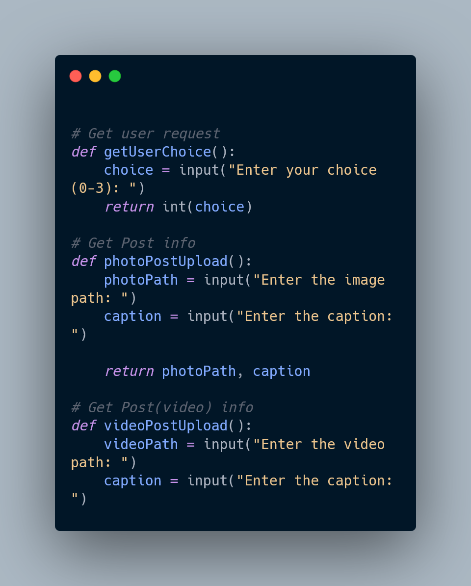

# Python Script

[](https://www.python.org/downloads/release/python-390/)

## Description
This is a Python script to automate Instagram actions(Bot) I have used instagrapi API which I will share the link below.
(https://github.com/adw0rd/instagrapi)
The script is not completed yet but you can use it to automate uploading posts and stories to your Instagram account.

## Installation
1. Make sure you have Python 3.0 installed. You can download it from [here](https://www.python.org/downloads/release/python-390/).
2. Clone this repository:

   ```shell
   git clone https://github.com/AlirezaRafiyian/InstagramBot.git

I. Navigate to the project directory:
  cd your-repository
II. Install the required dependencies: pip install -r requirements.txt
